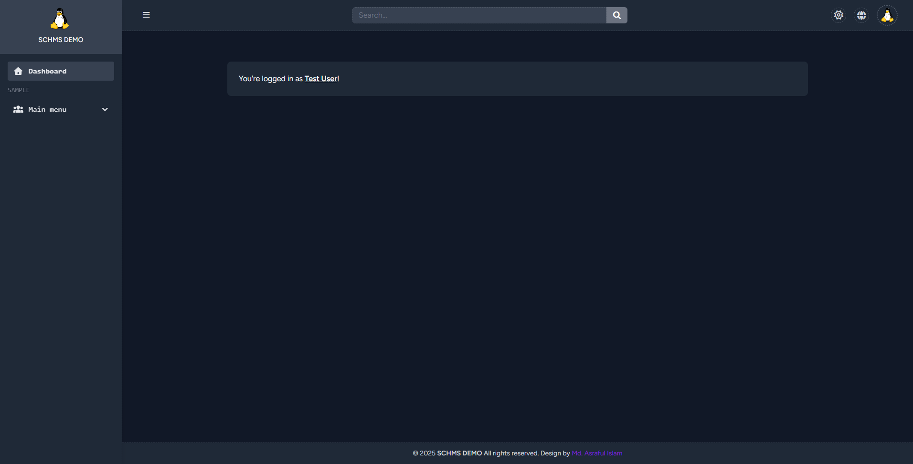

# Laravel Starter Demo

A ready-to-develop Laravel 12 project featuring the Breeze starter kit, a custom admin dashboard, and modern frontend tooling.

## Features

- **Laravel 12**: Latest stable release.
- **Laravel Breeze**: Simple authentication scaffolding.
- **Custom Admin Dashboard**: Built with Blade and Alpine.js.
- **Tailwind CSS**: Includes dark mode support.
- **FOUC Prevention**: Theme switching avoids Flash of Unstyled Content.
- **FontAwesome 7**: Integrated for rich iconography.

## Getting Started

1. **Clone the repository**
    ```bash
    git clone https://github.com/search4asraful/laravel-starter-demo.git
    cd laravel-starter-demo
    ```

2. **Install dependencies**
    ```bash
    composer install
    npm install
    ```

3. **Environment setup**
    - Copy `.env.example` to `.env`
    - Set your database credentials

4. **Run migrations**
    ```bash
    php artisan migrate
    ```

5. **Build assets**
    ```bash
    npm run dev
    ```

6. **Start the server**
    ```bash
    php artisan serve
    ```

## Customization

- **Dashboard**: Modify Blade templates in `resources/views/admin`.
- **Theme Switching**: Uses Alpine.js for toggling dark mode; see `resources/js/theme.js`.
- **Icons**: Use FontAwesome 7 classes in your Blade files.

## Credits

- [Laravel](https://laravel.com/)
- [Breeze](https://laravel.com/docs/breeze)
- [Tailwind CSS](https://tailwindcss.com/)
- [Alpine.js](https://alpinejs.dev/)
- [FontAwesome 7](https://fontawesome.com/)

---

Happy coding!

### Dashboard Screenshot

